<br>
<br>

<div align="center">

# 🦯 SmartCane

### AI 기반 시각장애인 스마트 보행 지원 앱

**SmartCane**은 시각장애인의 자립 보행을 돕는 AI 스마트 지팡이 앱입니다.  
카메라로 실시간 주변 환경을 인식하고,  
보도·점자블록·횡단보도·장애물을 AI가 감지하여 음성으로 안내하며,  
목적지까지 안전하게 경로를 탐색해 드립니다.

</div>

<br>
<br>

---

<div align="center">

## 📆 목차

<br><br>

**[프로젝트 개요](#-프로젝트-개요)**

**[주요 기능](#-주요-기능)**

**[자동 신고 안전맵](#5-자동-신고-안전맵-smartcane-위험지도)**

**[AI 기술](#-ai-기술)**

**[하드웨어](#-하드웨어)**

**[기술 스택](#-기술-스택)**

**[시스템 아키텍처](#-시스템-아키텍처)**

**[팀 구성](#-팀-구성)**

</div>

<br>
<br><br>
<br>

---

<div align="center">

## 📄 프로젝트 개요

<br>

**SmartCane**은 시각장애인의 독립적인 이동권을 보장하기 위한 AI 스마트 보행 지원 앱입니다.

**온디바이스 AI 세그멘테이션**으로 보도·차도·점자블록을 실시간 구분하고,  
**YOLO 기반 객체 탐지**로 볼라드·횡단보도·신호등을 인식하며,  
**카카오맵 연동 경로 탐색**으로 목적지까지 턴바이턴 음성 안내를 제공합니다.

보고, 듣고, 안전하게 걷는 스마트 보행 경험을 제공합니다.

</div>

<br>
<br>

<table>
  <tr>
    <td>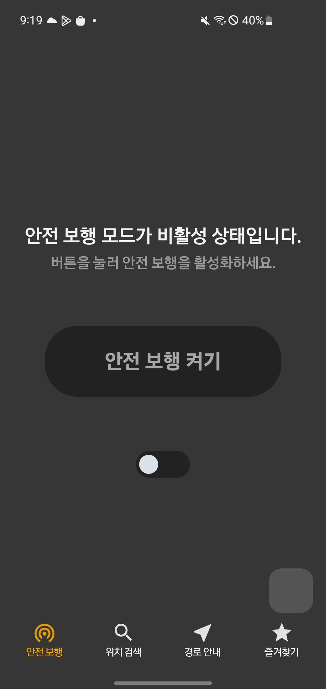</td>
    <td>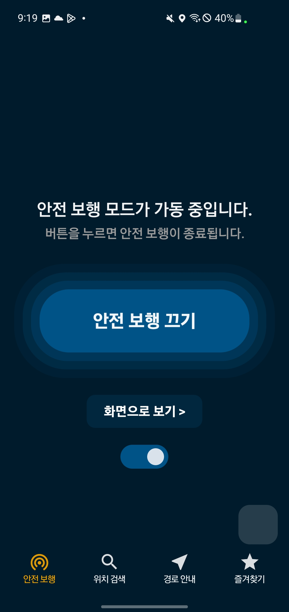</td>
    <td>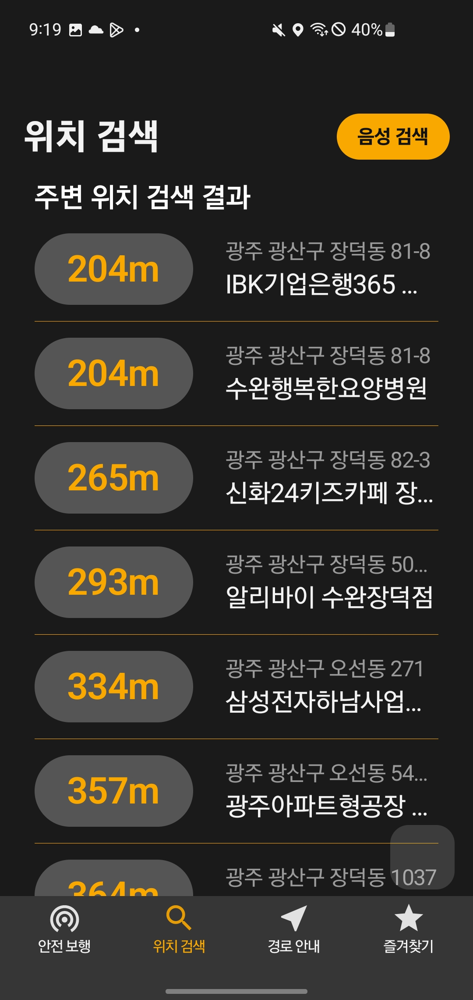</td>
    <td>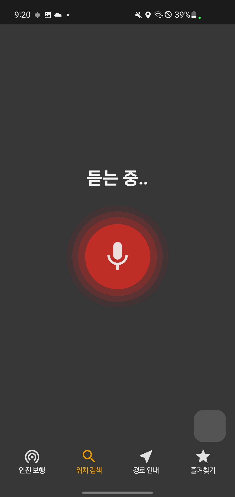</td>
  </tr>
  <tr>
    <td>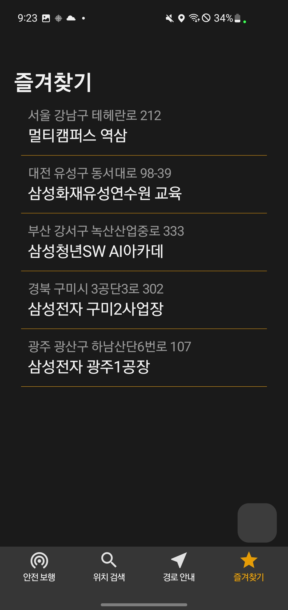</td>
    <td>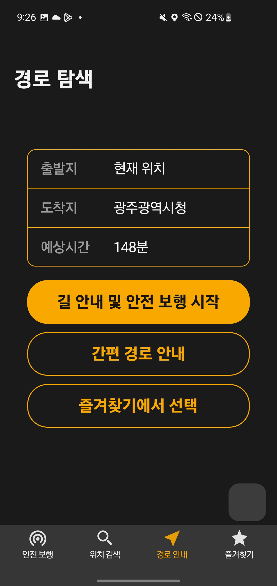</td>
    <td>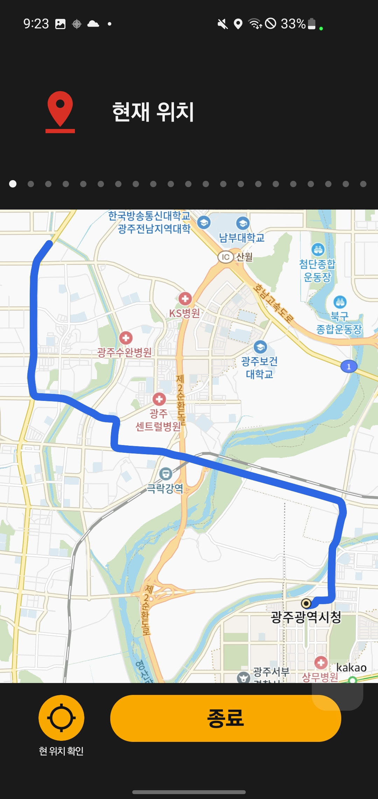</td>
    <td>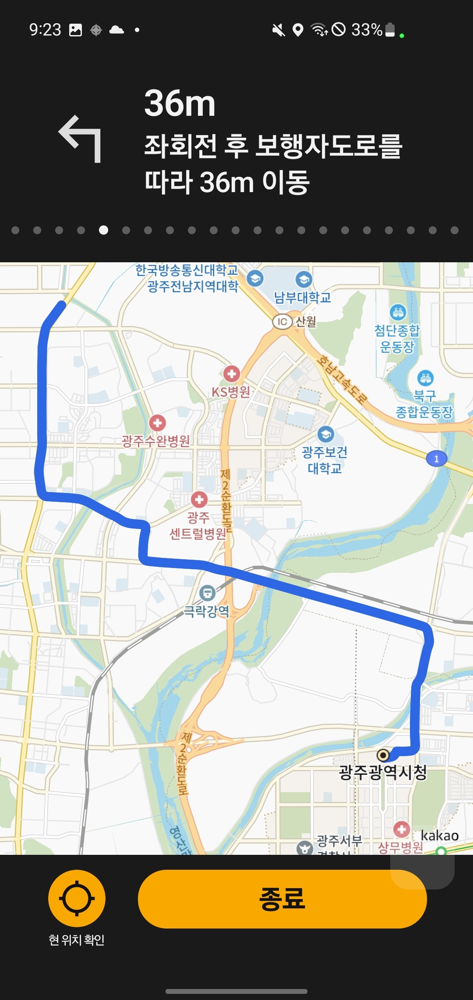</td>
  </tr>
</table>

<br>
<br><br>
<br>

---

<div align="center">

## 💡 주요 기능

<br>

</div>

### 1. 안전 보행 모드

- 앱 실행 후 버튼 하나로 **안전 보행 활성화/비활성화** 전환
- 보행 중 AI가 전방 환경을 실시간 분석하여 위험 요소를 음성으로 안내
- 활성화 시 **화면으로 보기** 버튼으로 AI 카메라 시점 전환 가능

<table>
  <tr>
    <td align="center"><b>비활성 상태</b></td>
    <td align="center"><b>활성 상태</b></td>
  </tr>
  <tr>
    <td></td>
    <td></td>
  </tr>
</table>

<br><br><br>

### 2. 위치 검색

- 현재 위치 기준 **주변 장소 실시간 검색** 및 거리순 목록 제공
- **음성 검색** 버튼으로 마이크에 말하면 자동 검색

<table>
  <tr>
    <td></td>
    <td></td>
  </tr>
</table>

<br><br><br>

### 3. 경로 안내

- 출발지(현재 위치) / 도착지 / 예상 소요 시간 확인 후 안내 시작
- **길 안내 및 안전 보행 동시 실행** 모드 지원
- 카카오맵 기반 경로를 지도에 표시하고 **턴바이턴 음성 안내** 제공
- 현재 위치 확인 버튼으로 지도 중심 이동

<table>
  <tr>
    <td></td>
    <td></td>
    <td></td>
  </tr>
</table>

<br><br><br>

### 4. 즐겨찾기

- 자주 가는 장소를 즐겨찾기로 저장
- 목록에서 선택하면 바로 **경로 안내 시작** 가능

<table>
  <tr>
    <td></td>
  </tr>
</table>

<br><br><br>

### 5. 자동 신고 안전맵 (SmartCane 위험지도)

- 보행 중 AI가 감지한 위험 요소를 **자동으로 서버에 신고** 및 누적
- 웹 대시보드에서 지도 위에 위험 지점을 **유형별로 시각화**
- 볼라드·하이케이·손상된 보도·손상된 점자블록·맨홀·공사구역·교차로·신호등 등 **14가지 위험 유형** 분류
- **횡단보도 / 교차로 / 신호등** 레이어 ON/OFF 필터링
- 각 위험 지점 클릭 시 **신고 사진·날짜·신뢰도** 상세 확인

<table>
  <tr>
    <td align="center"><b>위험지도 전체 뷰</b><br><sub>위험 유형별 마커 필터링</sub></td>
    <td align="center"><b>위험 신고 목록</b><br><sub>신고 사진 · 날짜 · 신뢰도 상세</sub></td>
  </tr>
  <tr>
    <td>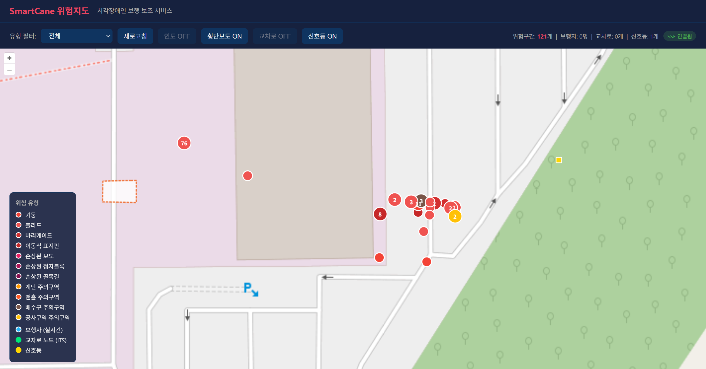</td>
    <td>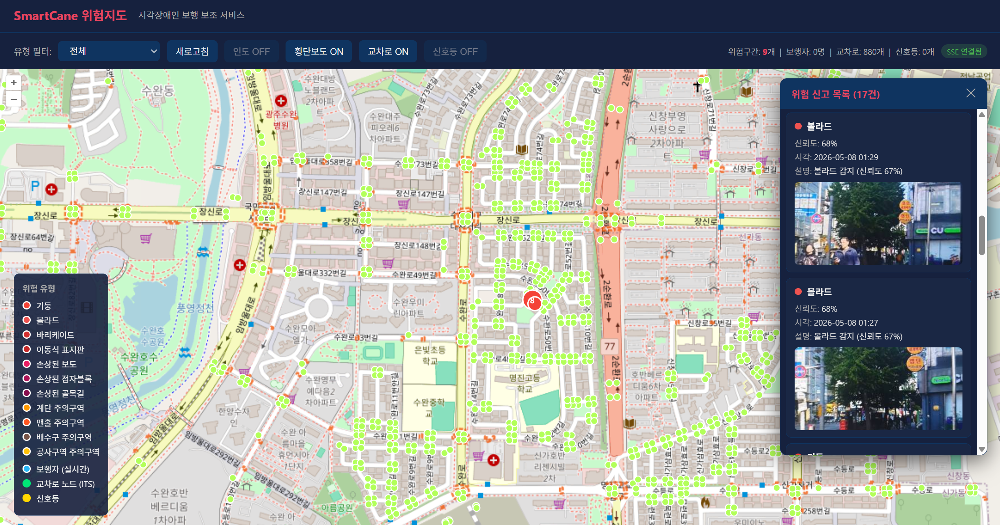</td>
  </tr>
</table>

<br>
<br><br>
<br>

---

<div align="center">

## 🤖 AI 기술

<br>

SmartCane은 **Segmentation** 과 **Detection** 두 모델이 동시에 실행되어  
각각의 결과를 합산해 최종 보행 판단을 내립니다.

<br>

```
      카메라 프레임
      │
      ┌──────────────────────────────┐
      │                              │
      ▼                              ▼
 Segmentation                   Detection
 (SegFormer+SLAM)              (YOLOv11n)
 보도 / 차도 / 점자블록         볼라드 / 신호등
 자전거도로 픽셀 분류           횡단보도 / 장애물 감지
      │                              │
      └──────────────┬───────────────┘
                     ▼
              보행 판단 & 음성 안내
       (경로 이탈 / 장애물 경고 / 신호 안내)
```

</div>

<br>

---

### 🗺️ Segmentation — 보도 환경 분류 (SegFormer + SLAM)

<br>

> 보행 환경을 픽셀 단위로 분류하여 사용자가 현재 어디를 걷고 있는지 실시간으로 파악합니다.  
> 초기 모델(DeepLabV3+) 대비 속도와 정밀도를 대폭 개선했습니다.

<br>

<table>
  <tr>
    <th align="center" width="50%">❌ Before — DeepLabV3+ Fine Tune (3cls)</th>
    <th align="center" width="50%">✅ After — SegFormer + SLAM</th>
  </tr>
  <tr>
    <td align="center">
      추론 속도: <b>~1.4 FPS</b><br>
      파이프라인: <b>686~707 ms</b><br>
      클래스: 3cls (traffic_light / cow / car)<br>
      <i>보행 환경 분류 부적합, 실사용 불가 수준</i>
    </td>
    <td align="center">
      추론 속도: <b>130~156 FPS</b><br>
      출력: <b>6+ FPS</b> (파이프라인 141~170 ms)<br>
      클래스: 보도 / 점자블록 / 차도 / 자전거도로<br>
      <i>보행로 정밀 분류, 실시간 안내 가능</i>
    </td>
  </tr>
  <tr>
    <td>
      <table>
        <tr>
          <td>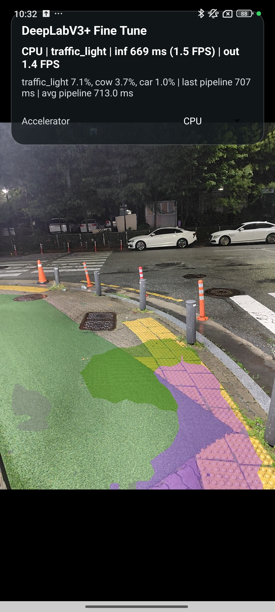</td>
          <td>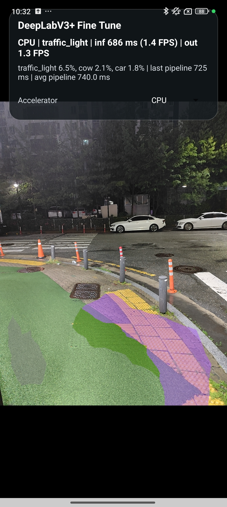</td>
        </tr>
        <tr>
          <td>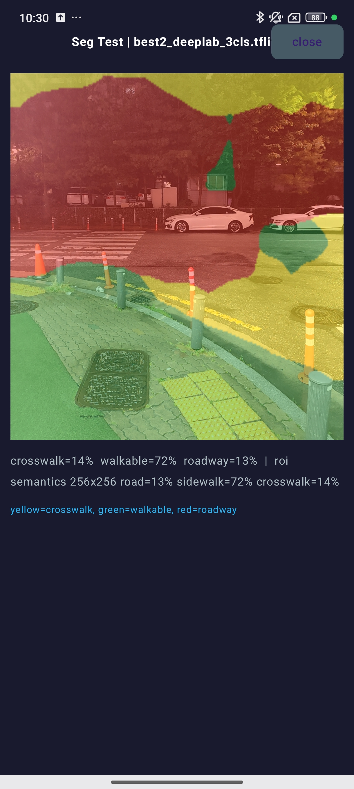</td>
          <td>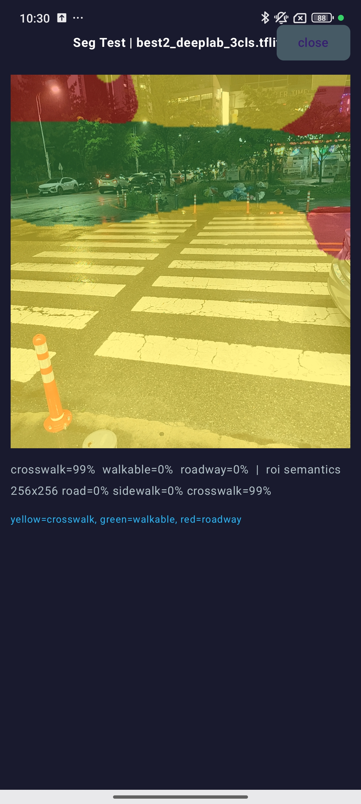</td>
        </tr>
      </table>
    </td>
    <td>
      <table>
        <tr>
          <td>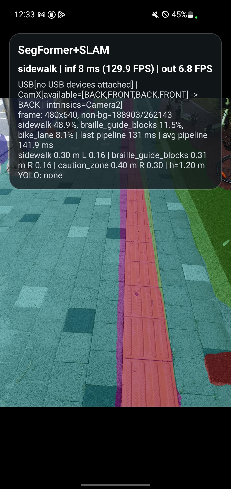</td>
          <td>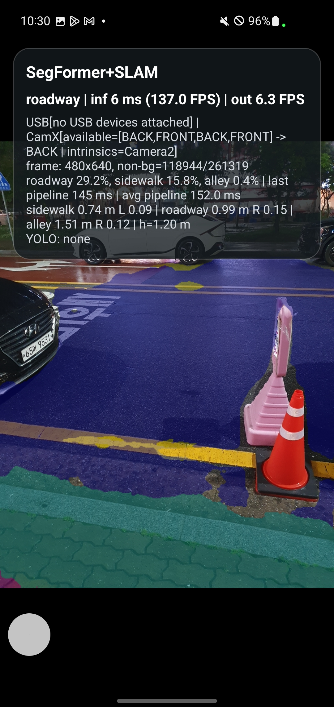</td>
        </tr>
        <tr>
          <td colspan="2">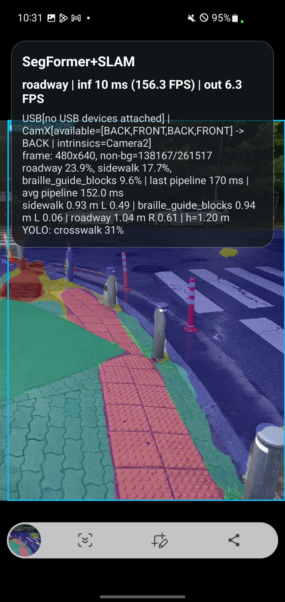</td>
        </tr>
      </table>
    </td>
  </tr>
</table>

<br>

| 항목 | Before (DeepLabV3+) | After (SegFormer+SLAM) |
|:---:|:---:|:---:|
| 추론 속도 | 1.3~1.5 FPS | **130~156 FPS** |
| 파이프라인 지연 | 686~740 ms | **141~170 ms** |
| 보행로 분류 정밀도 | 부적합 (교통 객체 분류) | **보도·점자블록·차도 정밀 분류** |
| 실시간 안내 가능 여부 | ❌ | ✅ |

<br><br>

---

### 🔍 Detection — 장애물 및 교통 요소 탐지 (YOLOv11n)

<br>

> Segmentation과 동시에 실행되어 보도 위의 장애물, 신호등, 횡단보도를 감지합니다.  
> 두 모델의 결과를 결합하여 "걸어도 되는가"를 최종 판단합니다.

<br>

**감지 대상**: 볼라드 · 신호등 · 횡단보도 · 사람 · 버스 · 차량 · 기둥 · 이정표 등

<table>
  <tr>
    <td align="center"><b>TrafficLight V5.0</b><br><sub>신호등 · 보행자 신호 인식</sub></td>
    <td align="center"><b>객체 탐지 (YOLO)</b><br><sub>차량 · 사람 · 볼라드 · 기둥 감지</sub></td>
    <td align="center"><b>통합 파이프라인</b><br><sub>전방 제한 경고 + 볼라드 + 점자블록</sub></td>
  </tr>
  <tr>
    <td>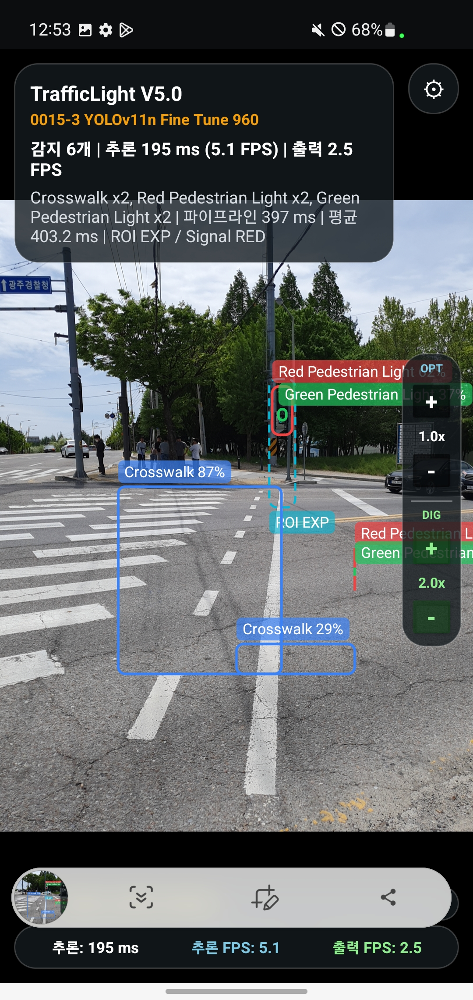</td>
    <td>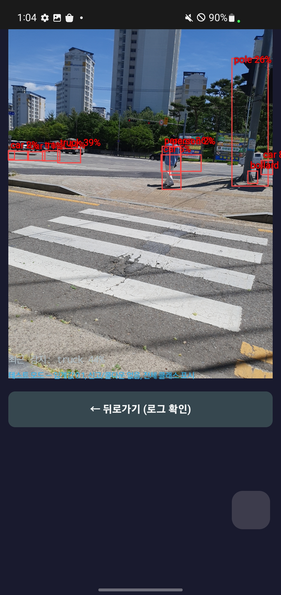</td>
    <td>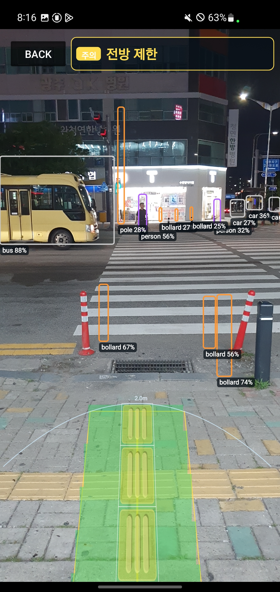</td>
  </tr>
  <tr>
    <td align="center"><b>횡단보도 신호 확인</b><br><sub>횡단보도 감지 + 신호 상태 안내</sub></td>
    <td align="center"><b>다중 객체 탐지</b><br><sub>볼라드 · 기둥 · 차량 · 이정표 인식</sub></td>
    <td></td>
  </tr>
  <tr>
    <td>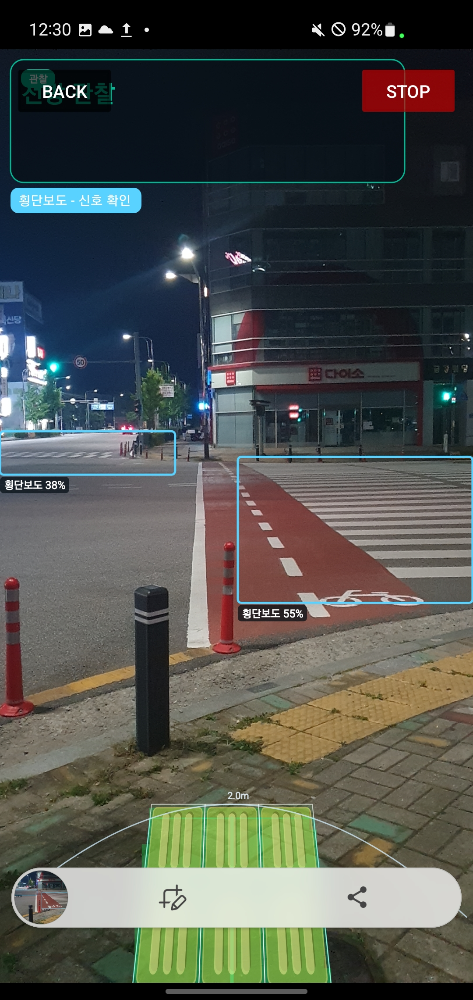</td>
    <td>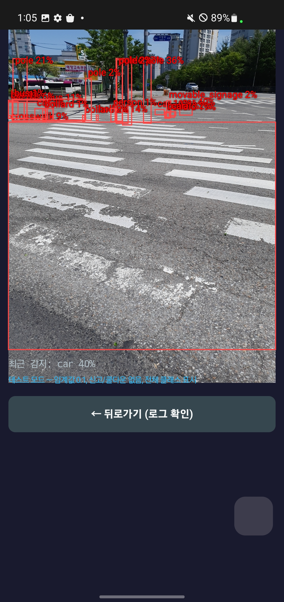</td>
    <td></td>
  </tr>
</table>

<br>
<br><br>
<br>

---

<a id="-하드웨어"></a>
<div align="center">

## ⌚ 하드웨어

<br>

SmartCane은 **손목 착용형 진동 피드백 디바이스**를 함께 사용합니다.  
앱의 AI가 위험을 감지하면 BLE로 신호를 전송하고,  
손목 밴드의 **좌/우 진동 모터**가 방향과 위험 수준을 촉각으로 알려줍니다.

</div>

<br>

### 디바이스 설계

<table>
  <tr>
    <td align="center"><b>완성품</b><br><sub>손목 착용형 웨어러블</sub></td>
    <td align="center"><b>분해도</b><br><sub>케이스 · ESP32 · 배터리 · 진동모터</sub></td>
    <td align="center"><b>내부 회로</b><br><sub>XIAO ESP32-C3 + 코인형 진동모터 × 2</sub></td>
  </tr>
  <tr>
    <td>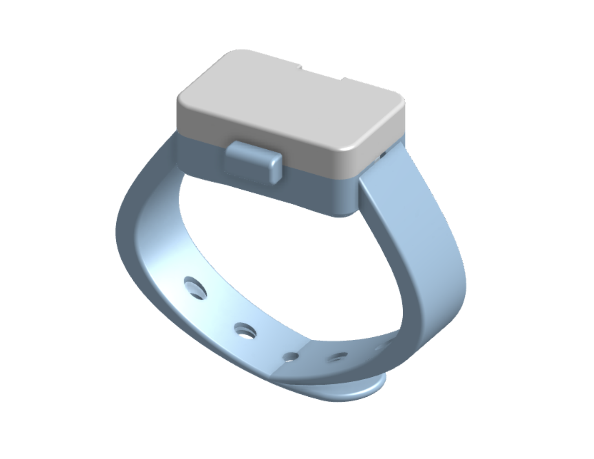</td>
    <td>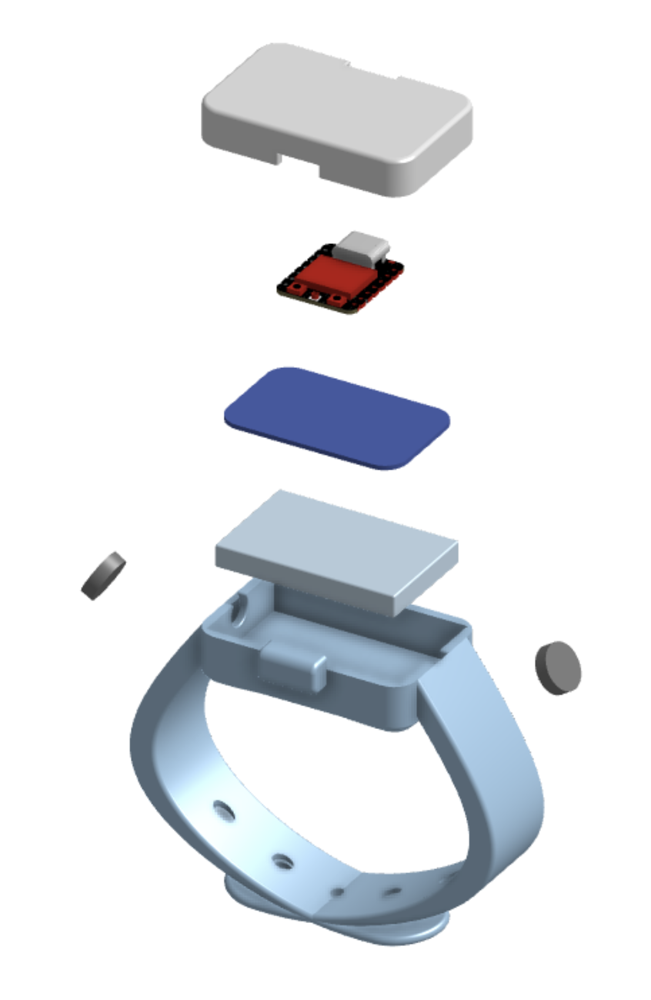</td>
    <td>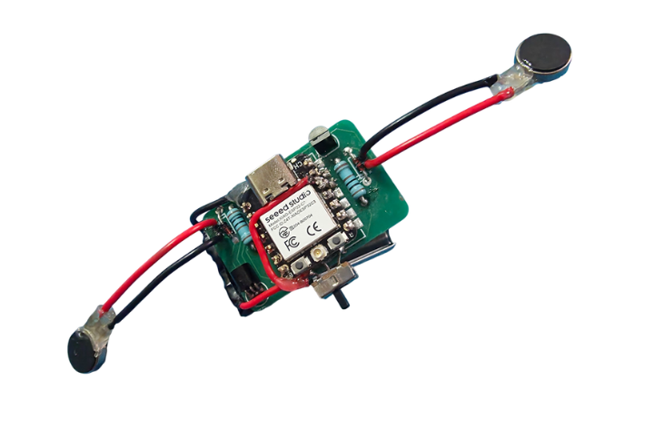</td>
  </tr>
</table>

<br>

### 부품 명세

| **분류** | **항목** | **규격 및 상세** | **수량** |
|:---:|:---:|:---|:---:|
| **MCU** | 제어 보드 | Seeed Studio **XIAO ESP32-C3** | 1 |
| **Actuator** | 진동 모터 | 3V-3.7V 코인형 진동모터 | **2** |
| **Power** | 배터리 | 3.7V LiPo 배터리 (용량은 케이스 크기에 맞춤) | 1 |
| **Switch** | 입력 스위치 | 택트 스위치 또는 슬라이드 스위치 (GPIO 입력용) | 1 |
| **Circuit** | 트랜지스터 | NPN 트랜지스터 (예: 2N2222, SS8050 등) | 2 |
| **Circuit** | 저항 | **1kΩ** (Base 전류 제한용) | 2 |
| **Circuit** | 다이오드 | 1N4148 (Flyback Diode) | 2 |
| **Material** | 고정재 | **폼 타입 양면테이프** (배터리 고정용) | - |

<br>

### 진동 패턴

좌/우 모터를 독립적으로 제어하여 상황별로 다른 촉각 피드백을 제공합니다.

| **상황** | **왼쪽 모터** | **오른쪽 모터** | **패턴** | **의미** |
|:---:|:---:|:---:|:---:|:---:|
| 좌회전 안내 | 진동 ● | 정지 ○ | 단속 1회 | 왼쪽으로 이동 |
| 우회전 안내 | 정지 ○ | 진동 ● | 단속 1회 | 오른쪽으로 이동 |
| 직진 안내 | 진동 ● | 진동 ● | 단속 1회 | 앞으로 진행 |
| 전방 장애물 경고 | 진동 ● | 진동 ● | 빠른 반복 3회 | 즉시 정지 |
| 횡단보도 — 정지 신호 | 진동 ● | 진동 ● | 긴 진동 1회 | 대기 |
| 횡단보도 — 보행 신호 | 교번 진동 | 교번 진동 | 좌→우 교번 반복 | 건너도 됨 |
| 경로 이탈 | 정지 ○ | 진동 ● | 빠른 반복 2회 | 경로 복귀 필요 |

<br>
<br><br>
<br>

---

<a id="-기술-스택"></a>
<div align="center">

## 🛠️ 기술 스택

<br>

### 📱 Android App


-FF6F00?style=for-the-badge&logo=tensorflow&logoColor=white)


-607D8B?style=for-the-badge&logoColor=white)

### 🤖 AI / On-device Model


### ⚙️ Backend


### 🗄️ Database & Infrastructure

-4169E1?style=for-the-badge&logo=postgresql&logoColor=white)


### 🔧 DevOps & Environment


### 💬 Communication


</div>

<br>
<br>

---

<a id="-시스템-아키텍처"></a>
<div align="center">

## 🗃️ 시스템 아키텍처

</div>

<br>

> 시스템 아키텍처 이미지를 `docs/images/system.png` 경로에 추가해 주세요.

<!--  -->

<br>
<br>

---

<div align="center">

## 👥 팀 구성

<br>

<table>
  <tr>
    <th>이름</th>
    <th>역할</th>
    <th>담당 기능</th>
    <th>GitHub</th>
  </tr>
  <tr>
    <td><nobr>팀원1</nobr></td>
    <td>Infra</td>
    <td>CI/CD 및 k3s 인프라, Jenkins 자동 배포, Traefik ingress, 모니터링 구축</td>
    <td><a href="#">@github</a></td>
  </tr>
  <tr>
    <td><nobr>팀원2</nobr></td>
    <td>AI</td>
    <td>SegFormer+SLAM 세그멘테이션, YOLOv11n 객체 탐지, TrafficLight 파이프라인 구현</td>
    <td><a href="#">@github</a></td>
  </tr>
  <tr>
    <td><nobr>팀원3</nobr></td>
    <td>Android</td>
    <td>Jetpack Compose UI, CameraX 연동, 안전 보행 모듈, 음성 안내 기능 개발</td>
    <td><a href="#">@github</a></td>
  </tr>
  <tr>
    <td><nobr>팀원4</nobr></td>
    <td>Android</td>
    <td>경로 안내, 카카오맵 연동, 위치 검색, 즐겨찾기 기능 개발</td>
    <td><a href="#">@github</a></td>
  </tr>
  <tr>
    <td><nobr>장상민</nobr></td>
    <td>Backend, Android</td>
    <td>Spring Boot 백엔드, PostGIS 공간 쿼리, Redis 캐싱, AWS S3 연동, API 설계, CameraX 연동</td>
    <td><a href="https://github.com/thermoCat">@thermoCat</a></td>
  </tr>
</table>

</div>

<br>
<br><br>
<br>

---

<div align="center">

<br>

### 라이센스

<br>

SSAFY(삼성 청년 소프트웨어 아카데미) 14기 자율 프로젝트

**S14P31C102 SmartCane**

</div>

<br>
<br>

---

**마지막 업데이트**: 2026-05-27
